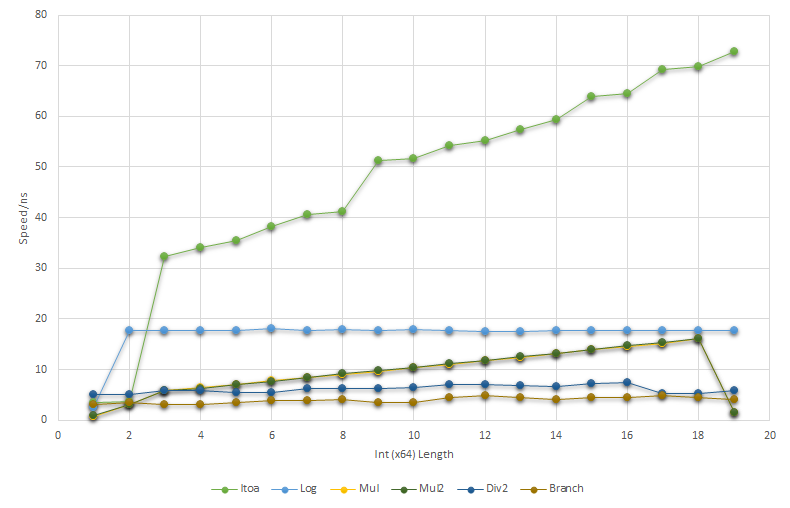

Itoa Length
===========
This is a quick test on the best way to find the string length of an `itoa` output.

Our base line is `ItoalenWithItoa`, e.g. `len(strconv.Itoa(123))`. This is the 
worst we can do: not only is performance `O(n)`, there is also allocation per call.

Using log (`ItoalenWithLog`) is a lot better. At least we're getting `O(1)`.

Repeated multiplication (`ItoalenWithMul`) beats using log, although we're back 
to being `O(n)`. I tried using bit shift (`ItoalenWithMul2`), with exactly the 
same performance. Looks like Go compiler has optimized this away already.

The fastest algo I found that is still elegant is division by 2 (`ItoalenWithDiv2`). 
It's basically `O(1)`, or at least a very gradual `O(n)` slope. It's also faster 
than all the above.

The actual winner is, unsurprisingly, just old plain `if...else` branching. It's 
ugly but...yeah it works.




Benchmark script
----------------
Create log:

```bash
GO111MODULE=off go test -v -bench=. > bench_result.log
```

Massage into csv, then paste into Excel:

```powershell
Get-Clipboard | where { $_ -like "*-2*" } | % { 
    $funcName = $_.Split(' ')[0].Split('/')[0].Substring('BenchmarkItoalenWith'.Length)
    $intlen = $_.Split(' ')[0].Split('/')[1].Substring('intlen_'.Length).Split('-')[0]
    $speed =  $_.Substring($_.LastIndexOf('  ')).Trim().Split(' ')[0]

    '{0},{1},{2}' -f $funcName, $intlen, $speed
}
```